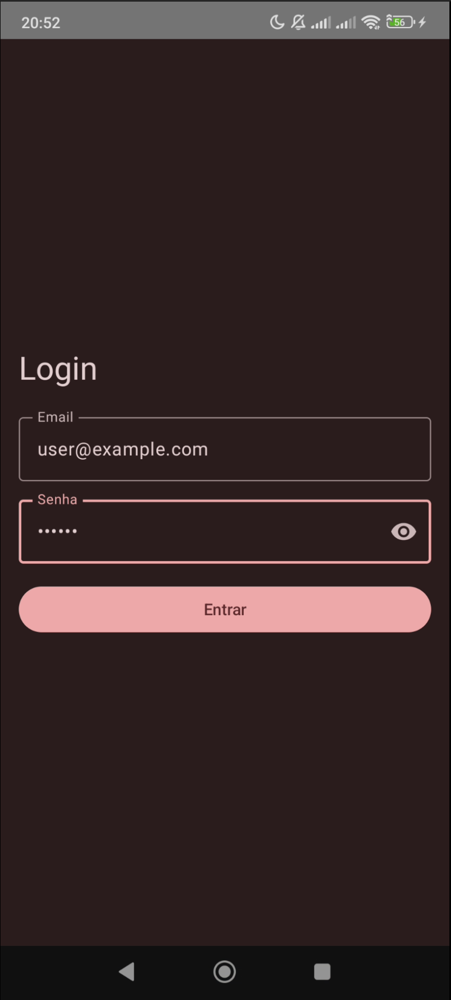
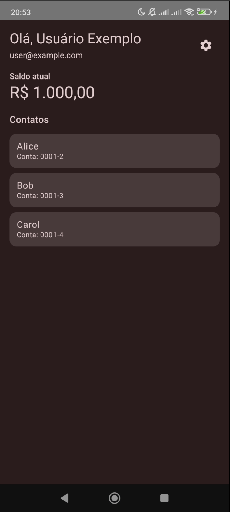
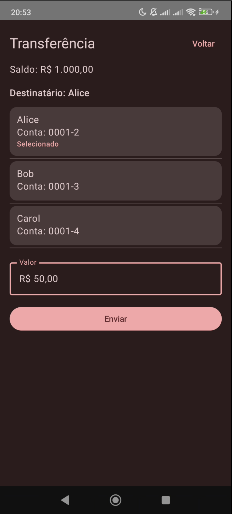
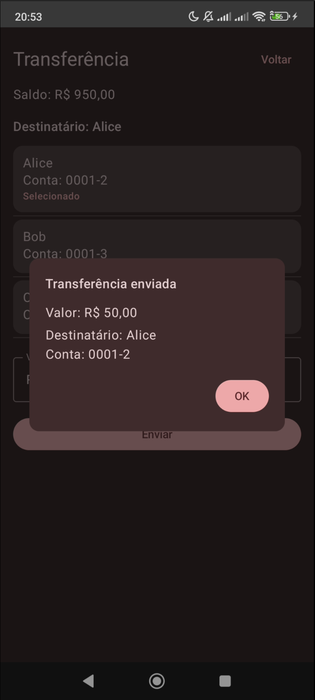
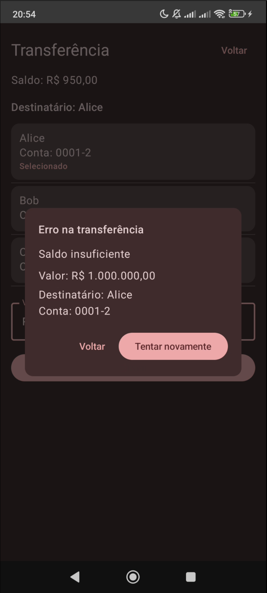
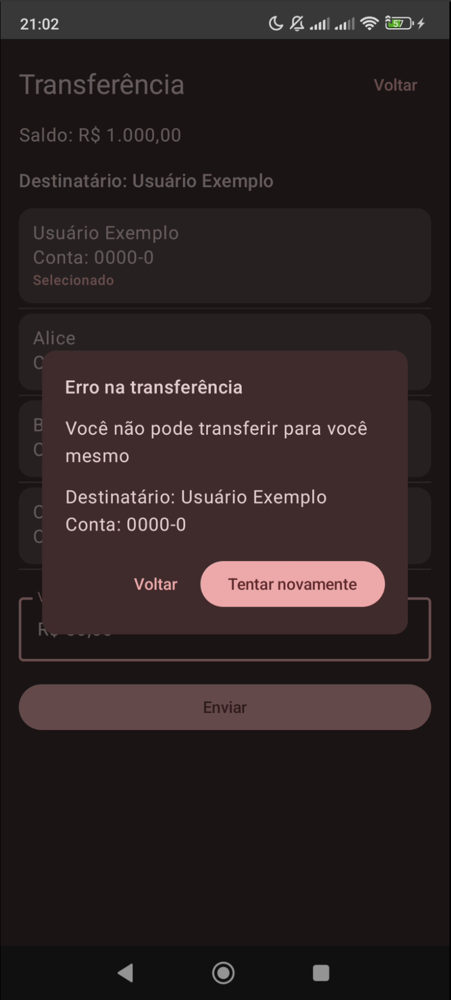

# Carteira de Pagamentos

Aplicativo Android em Jetpack Compose com arquitetura modular para autenticação, consulta de saldo e transferências. Este guia resume execução, testes, contrato HTTP e decisões técnicas.

Este projeto demonstra proficiência em arquitetura modular Android, camadas de dados configuráveis (offline/HTTP), testes automatizados e um fluxo realista de transferência com autorização via backend mock.

## Fluxo do app (alto nível)
```
[Login] --SharedPrefsAuthRepository salva sessão--> [AppViewModel escolhe Login ou Home]
   -> [Home carrega saldo+contatos (WalletRepository)]
   -> [Transfer seleciona contato, valida payer!=payee, saldo, valor>0]
   -> [AuthorizeService local/rede | FakeAuthorizeInterceptor]
   -> [WalletRepository.transfer] -> [AndroidNotifier cria notificação]
```

## Como rodar o app (passo a passo)
1. Android Studio Hedgehog+ com SDK configurado (`sdk.dir` em `local.properties`, ex.: `/home/user/Android/Sdk`).
2. Java 11+ (wrapper baixa Gradle 8.13 automaticamente).
3. Abrir o projeto, sincronizar Gradle e escolher o build variant **debug** (minSdk 24, targetSdk 36).
4. Rodar no emulador/dispositivo.
5. Por padrão roda **offline** com dados em memória.
6. Opcional: para usar o servidor Node (`simple server`), ligue **Configurações → Servidor HTTP mock**, mantenha/edite a base URL (preenchida com `http://192.168.1.110:3000/`), salve e refaça login. Credenciais mock: `user@example.com/123456` (ou Alice/Bob/Carol descritos no servidor).

## Como rodar os testes (passo a passo)
- `./gradlew test --console=plain --no-daemon`
  - Sem SDK configurado o build falha dizendo que `sdk.dir/ANDROID_HOME` não foi encontrado (esperado em máquinas só de CI).
- CI: `.github/workflows/android-ci.yml` executa o mesmo comando em push/PR com Java 17.

## Dependências e SDK
- **SDK**: compile/target 36, minSdk 24. 【F:app/build.gradle.kts†L10-L33】
- **Gradle wrapper**: 8.13. 【F:gradle/wrapper/gradle-wrapper.properties†L1-L8】
- **Android Gradle Plugin**: 8.13.1. 【F:gradle/libs.versions.toml†L1-L14】
- **Kotlin**: 2.0.21. 【F:gradle/libs.versions.toml†L1-L14】
- **Principais libs**: Compose BOM 2024.09.00, Material3, Activity Compose, Lifecycle, Coroutines, Hilt, Retrofit 2.11.0 + Moshi 1.15.1, OkHttp 4.12.0. 【F:app/build.gradle.kts†L49-L79】【F:core-data/build.gradle.kts†L47-L63】

## Contrato HTTP (mini guia)
- OpenAPI completa em `simple server/openapi.yaml` (resumo abaixo). 【F:simple server/README.md†L23-L25】
```
POST /auth/login
Req: { "email": "user@example.com", "password": "123456" }
Res: { "token": "fake-token-1", "user": { "id": "1", "name": "...", "email": "..." } }

GET /wallet/summary?userId=1
Res: { "balanceInCents": 100000 }

GET /wallet/contacts?userId=1
Res: [ { "id": "acc2", "ownerUserId": "2", "name": "Alice", "accountNumber": "0001-2" }, ... ]

POST /wallet/transfer
Req: { "userId": "1", "toContactId": "acc2", "amountInCents": 15000 }
Res: { "balanceInCents": 85000 } | { "message": "Saldo insuficiente" | "Valor inválido" | "Payer e payee não podem ser iguais" | ... }

POST /authorize
Req: { "value": 40300 }
Res: { "authorized": false, "reason": "operation not allowed" } (demais valores retornam { "authorized": true })
```

## Decisões arquiteturais e racional
- **Modularização por camada** (`core-domain`, `core-data`, `feature-*`, `app`) para isolar contratos, infraestrutura e UI; facilita mocks e builds independentes. 【F:app/build.gradle.kts†L62-L66】
- **DI com Hilt**: padroniza scopes e evita boilerplate manual; preferido a Koin para integrar com AndroidX/Hilt Navigation. 【F:app/src/main/java/com/example/carteiradepagamentos/di/AppModule.kt†L28-L74】
- **Rede opcional e configurável**: `AppPreferencesRepository` (SharedPreferences) escolhe entre fontes locais e HTTP (`Configurable*`), permitindo rodar offline ou apontar para o mock server. 【F:core-data/src/main/java/com/example/carteiradepagamentos/data/local/SharedPrefsAppPreferencesRepository.kt†L10-L42】【F:core-data/src/main/java/com/example/carteiradepagamentos/data/remote/ConfigurableWalletRepository.kt†L12-L29】
- **Autorização desacoplada**: `ConfigurableAuthorizeService` decide `NetworkAuthorizeService` (Retrofit dinâmico) ou `LocalAuthorizeService`; `FakeAuthorizeInterceptor` simula resposta de 40300 sem rede. 【F:core-data/src/main/java/com/example/carteiradepagamentos/data/service/ConfigurableAuthorizeService.kt†L9-L26】【F:core-data/src/main/java/com/example/carteiradepagamentos/data/remote/FakeAuthorizeInterceptor.kt†L16-L45】
- **Auto-login**: `SharedPrefsAuthRepository` lê sessão e `AppViewModel` já navega para Home se válido, sem splash extra. 【F:core-data/src/main/java/com/example/carteiradepagamentos/data/local/SharedPrefsAuthRepository.kt†L14-L40】【F:app/src/main/java/com/example/carteiradepagamentos/AppViewModel.kt†L17-L47】

## Abordagem de testes
- **Unidade (CI)**: `./gradlew test` cobre:
  - `core-data`: `NetworkAuthorizeServiceTest` usa MockWebServer para 40300; `NetworkWalletRepositoryTest`/`InMemoryWalletRepositoryTest` validam saldo/contatos; `SharedPrefsAuthRepositoryTest` cobre persistência de sessão.
  - `feature-login`/`feature-home`: `LoginViewModelTest` e `HomeViewModelTest` verificam carregamento, erros e logout.
  - `feature-transfer`: `TransferViewModelTest` cobre seleção de contato, validações de valor, saldo insuficiente, bloqueio 40300, bloqueio payer=payee e emissão de notificação.
- **Exploratórios**: `docs/exploratory-tests.md` lista cenários manuais (login, tema, rede, transferências).
- **CI**: GitHub Actions (`.github/workflows/android-ci.yml`) roda os unit tests em push/PR.

## Cenários específicos
- **Valor 403**: escolha um contato, digite `40300` (R$ 403,00) e confirme; `AuthorizeService` retorna `authorized=false` (via backend ou `FakeAuthorizeInterceptor`), e o app exibe "Transferência bloqueada por política de segurança (valor R$ 403,00)" sem notificação. 【F:simple server/index.js†L122-L144】【F:feature-transfer/src/main/java/com/example/carteiradepagamentos/feature/transfer/TransferViewModel.kt†L62-L113】
- **Notificação local pós-transferência**: em API 33+ a permissão `POST_NOTIFICATIONS` é pedida ao abrir a tela; faça uma transferência válida (>0, saldo suficiente, contato diferente do usuário) e, após o sucesso, o `AndroidNotifier` cria a notificação com valor e contato. 【F:feature-transfer/src/main/java/com/example/carteiradepagamentos/feature/transfer/TransferScreen.kt†L28-L67】【F:core-data/src/main/java/com/example/carteiradepagamentos/data/notification/AndroidNotifier.kt†L15-L52】

## Limitações e observações
- Servidor mock não tem autenticação real nem persistência; saldos resetam a cada boot. 【F:simple server/README.md†L3-L10】
- Falta detecção inteligente de offline/retry; erros são exibidos diretamente ao usuário.
- Não há testes instrumentados/E2E.
- A lista de contatos inclui propositalmente o próprio usuário (contato sintético) para exercitar a validação de payer ≠ payee em UI e testes. 【F:core-data/src/main/java/com/example/carteiradepagamentos/data/remote/NetworkWalletRepository.kt†L30-L57】【F:feature-transfer/src/test/java/com/example/carteiradepagamentos/feature/transfer/TransferViewModelTest.kt†L74-L132】

## Telas
- Login: 
- Home / contatos: 
- Transferência (seleção + valor): 
- Transferência enviada: 
- Erro por saldo insuficiente: 
- Erro por política (R$ 403,00): 
- Erro ao transferir para si mesmo: 

## Estrutura do projeto
```
app/
core-domain/
core-data/
feature-login/
feature-home/
feature-transfer/
simple server/
docs/
```

## Documentação complementar
- Testes exploratórios: `docs/exploratory-tests.md`
- Especificação OpenAPI: `simple server/openapi.yaml`
- Guia do servidor mock `/authorize`: `docs/mock-authorize-guide.md`
